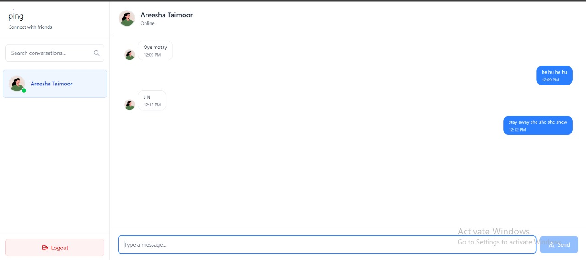

#  Ping – Real-Time Chat Application

A sleek real-time chat application featuring clean design secure authentication and persistent messaging  
Built using the modern MERN stack with real-time power from Socket.IO

---

## 📷 Preview

<table>
  <tr>
    <td><strong>Chat Interface</strong></td>
    <td><strong>Login Page</strong></td>
    <td><strong>Signup Page</strong></td>
  </tr>
  <tr>
    <td></td>
    <td></td>
    <td></td>
  </tr>
</table>

---

## ✨ Features

- 🔐 Secure JWT Authentication (HTTP-only cookies)
- 🔒 Password Hashing with bcryptjs
- 💬 Real-Time Messaging with Socket.IO
- 🟢 Online/Offline Status Indicators
- ✍️ Typing Notifications
- 💾 Persistent Messages via MongoDB
- 👤 Auto-generated Profile Images by Gender
- 📱 Fully Responsive White-Purple Themed UI
- 🎯 Form Validations and Error Handling

---

## 🧱 Tech Stack

### Frontend (React + Vite)

- React 19.1.0
- Vite 7.0.4
- Tailwind CSS 4.1.11 + DaisyUI 5.0.50
- React Router DOM 7.7.1
- Axios 1.11.0
- Socket.IO Client 4.8.1
- React Context API (`AuthContext`, `SocketContext`)
- ESLint + React Refresh + Hooks Rules

### Backend (Node.js + Express)

- Node.js
- Express 4.18.2
- MongoDB + Mongoose 7.5.0
- Socket.IO Server 4.8.1
- JWT Authentication + cookie-parser
- bcryptjs for password security
- CORS + dotenv + nodemon

---

## 🧠 MongoDB Models

### User Model
```js
{
  fullName: String,
  username: String,
  password: String,
  gender: String,
  profilePic: String,
  timestamps: true
}
Message Model
js
Copy
Edit
{
  senderId: ObjectId,
  receiverId: ObjectId,
  message: String,
  timestamps: true
}
Conversation Model
js
Copy
Edit
{
  participants: [ObjectId],
  messages: [ObjectId],
  timestamps: true
}
🔌 Socket.IO Events
Event	Description
connection	User connects to socket
join	User joins personal room
sendMessage	Emits a new message
newMessage	Broadcasts to recipient
getOnlineUsers	Updates online users list
disconnect	Handles user disconnect

📂 Folder Structure
Backend
pgsql
Copy
Edit
backend/
├── controllers/
├── db/
├── middleware/
├── models/
├── routes/
├── utils/
└── server.js
Frontend
css
Copy
Edit
frontend/src/
├── components/
├── pages/
├── socket/
├── utils/
├── App.jsx
├── main.jsx
└── index.css
🧪 API Endpoints
Method	Endpoint	Description
POST	/api/auth/signup	Register new user
POST	/api/auth/login	Login & set token
POST	/api/auth/logout	Clear session cookie
GET	/api/users	Fetch all users
GET	/api/messages/:id	Get messages in chat
POST	/api/messages/send/:id	Send a new message

🧰 Local Setup
Prerequisites
Node.js v18+

MongoDB (local or Atlas)

Environment Variables (/backend/.env)
ini
Copy
Edit
MONGO_URI=<your_mongo_uri>
JWT_SECRET=<your_jwt_secret>
Start Backend
bash
Copy
Edit
cd backend
npm install
npm run dev
Start Frontend
bash
Copy
Edit
cd frontend
npm install
npm run dev
🔐 Security Practices
JWTs stored in HTTP-only cookies

Passwords hashed with bcryptjs

Protected routes with Express middleware

Cross-Origin setup via CORS

Sensitive values handled via .env

📈 Planned Features (V2)
✅ Read receipts

🖼 Media uploads (images GIFs emojis)

🧑‍🤝‍🧑 Group chat support

🔔 Push notifications

🔍 Chat search functionality

🗑 Message delete/edit

🙋 Author
Developed with care by Saad Tiwana
Reach out if you're building something cool or just want to discuss architecture over chai ☕
