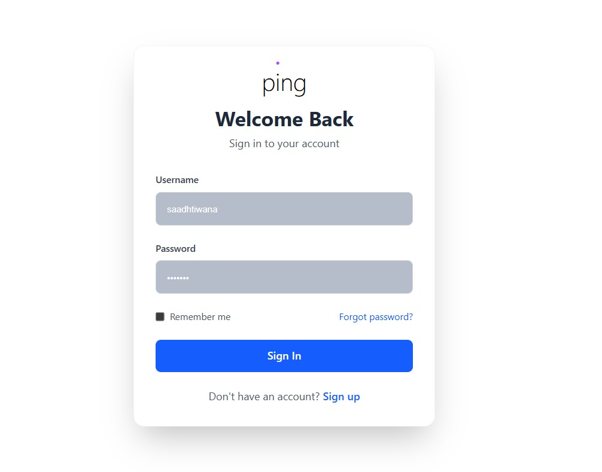
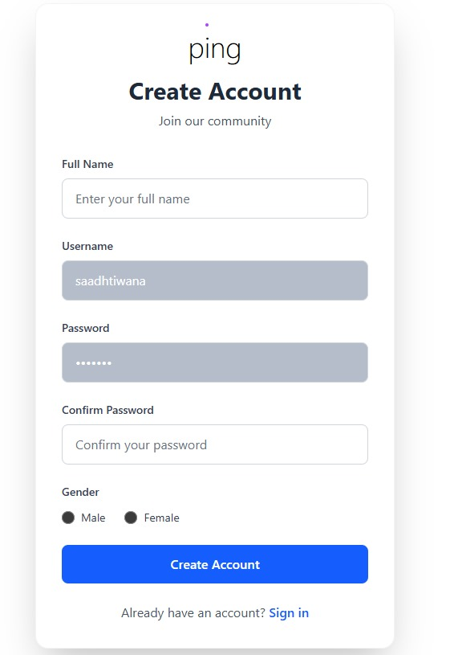

Ping – Real-Time Chat App
Ping is a simple and clean real-time chat application built using the MERN stack. It allows users to sign up log in and chat with each other in real time. The app uses Socket.IO for instant messaging and MongoDB for storing messages.

🔧 What I Did
Created frontend with React + Vite

Styled it using Tailwind CSS and DaisyUI

Used React Router DOM for routing

Implemented global state with React Context API (AuthContext + SocketContext)

Connected backend with Axios and proxy config

Backend built using Node.js + Express

Integrated MongoDB using Mongoose

Auth system with JWT (stored in HTTP-only cookies)

Passwords hashed with bcryptjs

Used Socket.IO for real-time messaging

Message typing indicators and online/offline status tracking

Messages are stored in MongoDB with proper schema design

Profile pictures auto-generated based on gender

Added proper form validation loading states and error handling

Made the UI fully responsive

🖼 Preview
<table> <tr> <td><strong>Chat Interface</strong></td> <td><strong>Login Page</strong></td> <td><strong>Signup Page</strong></td> </tr> <tr> <td></td> <td></td> <td></td> </tr> </table>
Let me know if you want to add links buttons deployment badge or make a GitHub profile-level version of this too 💻
